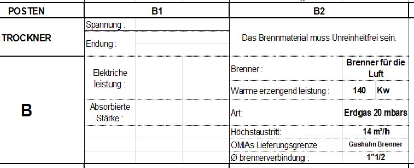
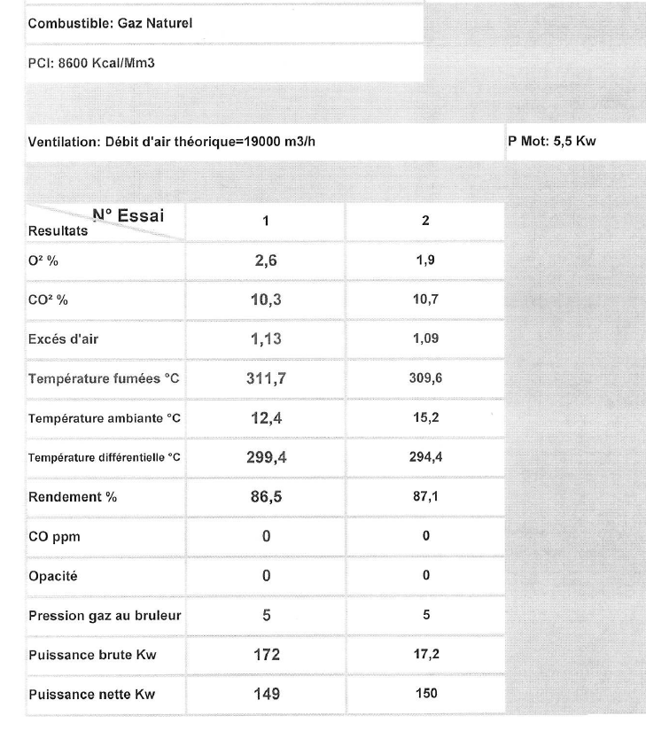
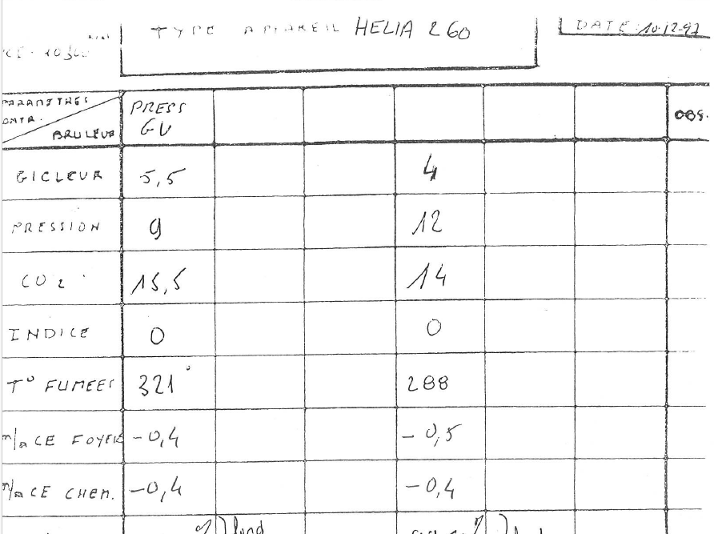
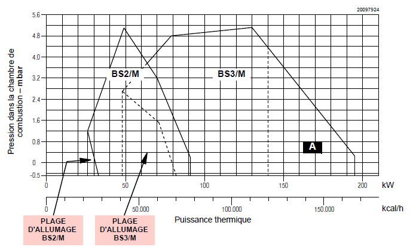

# Rapport interne - Calcul de conduits de fumée pour AF005215

# 1. Introduction

## 1.1 Hypothèses
Le texte de réference est la norme NF EN 13384-1+A1:2019 "Conduits de fumée - Métho
des de calcul"

Le système prise en examen comporte :

- Un bruleur gaz à air soufflé Riello BS3/M
- Un foyer échangeur de fabrication Omia GQ01 63
- Un conduit de raccordement de 200 mm de long et 200 mm de diamètre avec un angle de 90°
- un conduit de fumée de longuer 6.3 m et de diamètre 200 mm à l'intérieur du bâtiment
- un conduit de fumée de longuer 1.2 m et de diamètre 200 mm à l'extérieur du bâtiment

Les conduits sont en tôle métallique non isolé, 1 mm d'épaisseur. Le conduit situé à l'intérieur du batimen est dans un environnement chauffé (15 °C).

Aucun volet n'est installé dans le conduit de fumée.
La puissance du bruleur n'est pas modulable, le bruleur fonctionne en tout ou rien.
Un cône de condensation est situé au fond du raccord, avec un trou pour l'évacuation des condensats.

L'adresse de l'installation est Havighorster Weg 8C, 21031 Hamburg, Germania. Le site est situé à plus de 20 km de la mer et à une altitude de 41 m au-dessus du niveau de la mer.
Les températures minime des dernières années sont les suivantes :
2025 	-9.9 °C
2024 	-9.1 °C
2023 	-8.5 °C
2022 	-9.1 °C
2021 	-14.4 °C

D'après les plans, la puissance nominale de l'installation est de 140 kW

D'après essais réalisés par Omia, le rendement est de 86 % et la température des fumées à la sortie du foyer est de 310 °C.

Je n'ai pas de données concernant la pression maximale supportée par le conduit de fumée.

Nous n'avons pas de données sur le debit massique des fumées, mais la norme (5.5.2.1 pg. 20 et Tab B.1 pg. 99) donne une formule pour l'estimation théorique. Pour les valeurs données, nous avons un debit massique estimé de 0.068 kg/s.

La température de fumée la plus faible n'est pas connue, donc nous pouvons prendre 310 * 2/3 = 207 °C d'après 5.5.3.2 pg. 22

Le debit massique minimum n'est pas connue non plus, donc nous pouvons prendre 0.068/3 = 0.023 kg/s d'après 5.5.2.2 pg. 21

Aussi, d'après les tests réalisés par Omia, nous avons les pertes de charge suivantes:

Foyer échangeur : 0.45 mmCE d'eau = 4.4 Pa
Cheminée : 0.4 mmCE d'eau = 3.9 Pa

Pour la conversion en Pa, nous avons 1 mmCE d'eau = 9.8 Pa
## 1.2 Critères

Nous sommes dans le cas d'un conduit fonctionnant sous pression positive. Nous devons respecter les 4 critères suivants (pg.17, 5.1)

### 1.2 Critères de pression

1. La pression positive maximale à l’entrée des fumées dans le conduit doit être ≤ à la pression différentielle maximale à l’entrée des fumées dans le conduit.

Donc P_ZO ≤ P_ZOe 

avec :

Pression positive maximale (P_ZO) : pression que les fumées exercent à l’entrée du conduit de fumée à cause de l'effet du tirage, du vent et de pertes de charge du circuit de fumée.

Pression différentielle maximale (P_ZOe) : limite maximale de différence de pression que l’appareil de combustion peut accepter pour fonctionner correctement.

2. La pression positive maximale dans le conduit de raccordement des fumées et dans le conduit de fumée ne doit pas être supérieure à la pression maximale pour laquelle ils ont été désignés

Donc P_ZO ≤ P_Zexcess

avec :

P_Zexcess : pression maximale que le conduit de fumée peut supporter en service.

3. La pression positive minimale au niveau de l’admission des fumées dans le conduit doit être supérieure ou égale à la pression différentielle minimale au niveau de l’admission des fumées dans le conduit

Donc P_ZOmin ≥ P_ZOemin 

avec :

Pression positive minimale (PZOmin) : plus petite surpression que l’on peut avoir à l’entrée du conduit dans les conditions les plus défavorables (ex. extérieur très froid, pertes de charge plus fortes)

Pression différentielle minimale (P_ZOemin) : différence de pression minimale que l’appareil de combustion a besoin pour fonctionner correctement

### 1.2 Critères de température

4. La température de la paroi intérieure à la sortie du conduit de fumée doit être supérieure ou égale à la limite de température.
Donc T_iob ≥ T_ig

avec :

Température de paroi intérieure à la sortie (T_iob) : température réelle de la paroi interne du conduit de fumée à la sortie

Limite de température (T_ig) : c’est la température minimale fixée par la norme

Le valeur de T_ig est :
- égale à la température de rosée dans le cas d'un calcul sans condensation
- égale à 0 °C dans le cas d'un calcul avec condensation

## 1.3 Prises de mesure 03/10/2025

Avec Francis Diot, nous avons réalisé des prises de mesure le 03/10/2025 sur le foyer échangeur gaz de l'usine.

Température ambiante (non enregistrée) : ~25 °C

Pression dans la chambre de combustion pendant le fonctionnement : entre 0 et -10 Pa

Pression prise dans le conduit de fumée au niveau du trou de condensation: entre -30 et -40 Pa

Température de fumée au niveau du trou de condensation : 310 °C

C02 au niveau du trou de condensation : 8.5 %

Note:

- la pression dans la chambre de combustion monte considerablement lors de l'allumage du bruleur.
- D'après le test avec fumigène, la pression dans le conduit est négative même au bruleur éteint. La valeur n'est pas mésurable avec l'appareil de Francis.

# 2. Calculs

## 2.1 Pression - Critères 1-2
Nous avons les plage de pression de fonctionnement du bruleur, mais pas de l'ensemble bruleur + foyer. Cependant, j'estime que nous pouvons quand même justifier l'adhérence du conduit aux critères de pression imposés.

Le conduit de fumée dispose d'un volet réglable pour le bon fonctionnement du bruleur. Soit **P_R_volet** la perte de charge en Pa engendrée par le volet.

D'après les calculs, nous obtenons les valeurs suivant (estimation un peu grossière, pour presenter l'argument) :

P_ZO ≈ -3 Pa + P_R_volet
P_ZOmin ≈ -38 Pa + P_R_volet

Essentiellement, étant donné que la vitesse de la fumée est extrêmement faible, la perte de charge engendrée par le conduit est négligeable, avec une valeur de tirage bien plus importante (40 Pa) qui peut être compensée par le volet.

Nous avons le graphique suivant pour les plages de fonctionnement du bruleur :

donc entre -50 Pa et 300 Pa.

Il faut trouver comment le presenter auprès du client, mais à mon avis, avec ces données, nous respectons largement les critères de pression 1-2.

Nous avons une cheminée avec une perte de charge adjustable, à partir de -8 Pa avec une plage de pression qui varie de moins de 40 Pa

Le bruleur supporte une plage de variation bien plus importante. Si les critères de pression n'étaient pas ici respectés, alors ça ne serait pas la cheminée à devoir être remise en question, mais le système bruleur - foyer échangeur. 

## 2.2 Pression - Critère 3

Je n'ai pas d'élément concernant la pression maximale supportée par nos conduits de fumée. 
Réalistiquement, j'imagine que nos conduits peuvent supporter une pression d'au moins 300 Pa, ce qui est la pression maximale de fonctionnement du bruleur ?

## 2.3 Température - Critère 4

La température de rosée est estimée à 55 °C. Même si la température de la fumée à la sortie est autour de ~130 °C, la condution thermique avec l'air ambiant est bien plus importante, ce qui implique que nous avons sans doute de la condensation dans le conduit.

Cela nous oblige à réaliser le calcul avec condensation (Section 8, pg 82) ce qui est un calcul encore plus tédieux, qui demande de découper le conduit en segment, et pour chacun resoudre un système d'équations qui décrivent le processus de transfert thermique du à la condensation.
Il faut que la température de la paroi intérieure à la sortie du conduit de fumée soit ≥ 0 °C.

Nous devons considerer les hyphothèses les plus défavorables :
- Température extérieure : -15 °C
- Température intérieure : 15 °C
- Débit massique minimum : 0.023 kg/s
- Température de fumée minimum : 207 °C

Avec ces données, en appliquant la méthode de la section 8, nous obtenons une température de paroi intérieure à la sortie du conduit de fumée de 8 °C, qui respecte donc le critère 4.

